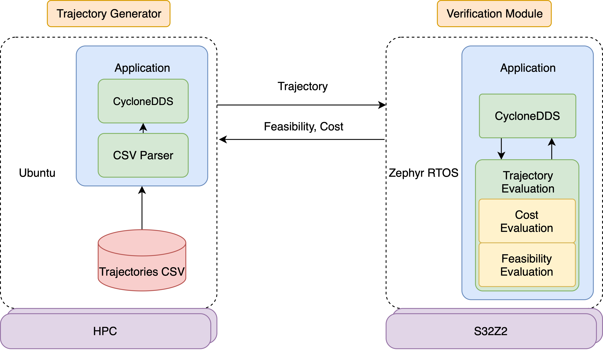

# Real-Time Motion Planning Supervisor

This repository provides an open-source reference implementation of a real-time trajectory verification module for autonomous vehicles. The system separates safety validation from the main planning stack and runs on dedicated embedded hardware using a real-time operating system (RTOS). It includes two primary components:

- **Trajectory Generator**: Runs on a Linux PC and publishes precomputed trajectories.
- **Supervisor Module**: Runs on an embedded platform and performs kinematic and plausibility checks in real time.

<div align="center">
  
</div>

## 🛠 About

<details>
This project accompanies the paper:

**Towards Safe Autonomous Driving: A Real-Time Safeguarding Concept for Motion Planning Algorithms**  
*Moller et al., 2025*

The Supervisor is designed to run on NXP’s S32Z2-based embedded platforms (e.g., the official Evaluation Board and the ARM Cortex-R Automotive Development System), while the Generator can run on any standard Linux host. The project builds on prior open-source components, including:

- [Frenetix Motion Planner](https://github.com/TUM-AVS/Frenetix)
- [Cyclone DDS Middleware](https://github.com/eclipse-cyclonedds/cyclonedds)
- [ARM Safety Island Actuation Demo](https://gitlab.arm.com/automotive-and-industrial/safety-island/actuation-demo)

</details>

## 🔧 Installation & Build Instructions

<details>
<summary><strong>📦 Physical Setup</strong></summary>

The image below shows the physical setup required to work with either the ARM Development Platform or the NXP Platform.


Connect the embedded board (NXP Evaluation Board or ARM Cortex-R Automotive Development System) as follows:

- Power via the standard power connector
- Debugging interface via JTAG to the PC (via S32 debug probe or Lauterbach probe)
- Ethernet cable to the same network as the PC
- Serial connection to view console output (e.g., via USB-UART)

> 💡 Use `/dev/ttyUSB*` on Linux or `COM*` on Windows and configure your serial tool (e.g. PuTTY or minicom) to 115200 baud.

> 💡 **Note:** When working with the ARM system, make sure you use the correct ethernet port.

</details>

<details>
<summary><strong>⚙️ Zephyr RTOS Setup (Supervisor)</strong></summary>

1. **Install Required Tools**
   Follow [Zephyr's Getting Started Guide](https://docs.zephyrproject.org/latest/develop/getting_started/index.html)

2. **Clone & Configure the Project**
   ```bash
   git clone https://gitlab.arm.com/automotive-and-industrial/safety-island/actuation-demo.git -b v2.1
   cd actuation-demo
   git submodule init
   git submodule update
   pip3 install -r zephyr/scripts/requirements-base.txt
   west init -l zephyr_app
   west update
   west zephyr-export
   ```

3. **Add the Supervisor Module**
   Place the `TrajectoryEvaluator` directory into the root of the actuation-demo repo.

4. **Build the Application**
   ```bash
   west build -b s32z270dc2_rtu0_r52@D TrajectoryEvaluator
   ```
   > ✅ For ARM board: add `-DEXTRA_DTC_OVERLAY_FILE=arm_ethernet.overlay` to enable Ethernet.

5. **Flash the Board**
   ```bash
   west debug --tool-opt='--batch'
   ```

</details>

<details>
<summary><strong>🖥️ Linux Setup (Trajectory Generator)</strong></summary>

1. **Install Cyclone DDS**
   Follow build instructions from [CycloneDDS GitHub](https://github.com/eclipse-cyclonedds/cyclonedds)

2. **Build the Generator**
   ```bash
   mkdir build && cd build
   cmake <path-to-TrajectoryGenerator> -DCMAKE_PREFIX_PATH=<path-to-cyclonedds>
   cmake --build .
   ```

3. **Run the Application**
   ```bash
   ./Trajectory_node
   ```

</details>

## 🧪 Evaluation Setup

The system was deployed on two embedded platforms based on the NXP S32Z2 real-time processor: the official NXP Evaluation Board and the ARM Cortex-R Automotive Development System. Both platforms use the same Cortex-R52 core and operate at 800 MHz with Zephyr RTOS (v3.5). Preliminary tests showed negligible timing differences between the platforms, so the main evaluation was conducted on the ARM system.

For reference, all experiments were repeated on an x86-based host machine featuring an AMD Ryzen 7840HS (up to 5.1 GHz) running Ubuntu 22.04.

## 📊 Results & Paper

The Supervisor demonstrates consistent low-latency performance with average evaluation runtimes around 1.1 ms on embedded hardware and jitter under 10%. In contrast to the HPC system, which achieves faster average runtimes, the embedded solution offers more stable execution and bounded variance. A detailed analysis and visualizations are included in the accompanying publication.

## 📁 Folder Structure

```
.
├── TrajectoryGenerator     # PC-side generator (DDS Publisher)
├── TrajectoryEvaluator     # RTOS-based verification logic
├── images/                 # Diagrams and figures
├── LICENSE
└── README.md
```


## 👥 Contributors

<details>
<summary>Click to expand</summary>

This project was developed at the [TUM Professorship of Autonomous Vehicle Systems](https://www.ce.cit.tum.de/en/avs/), Technical University of Munich.

- [Korbinian Moller](mailto:korbinian.moller@tum.de) (corresponding author)  
- Rafael Neher  
- Marvin Seegert  
- Johannes Betz

</details>

## 📖 Citation

<details>
<summary>Click to expand</summary>

If you use this code or the ideas in your research, please cite:

```bibtex
@article{moller2025realtimesupervisor,
  author       = {Korbinian Moller and others},
  title        = {A Real-Time Supervisor for Motion Planning in Autonomous Vehicles},
  journal      = {To appear},
  year         = {2025},
  note         = {GitHub repository: https://github.com/TUM-AVS/motion-planning-safeguard}
}
```

</details>


## 🤝 Acknowledgements

We thank ARM for providing access to the Cortex-R Automotive Development System.


## 📜 License

This project is licensed under the MIT License. See the [LICENSE](LICENSE) file for details.
